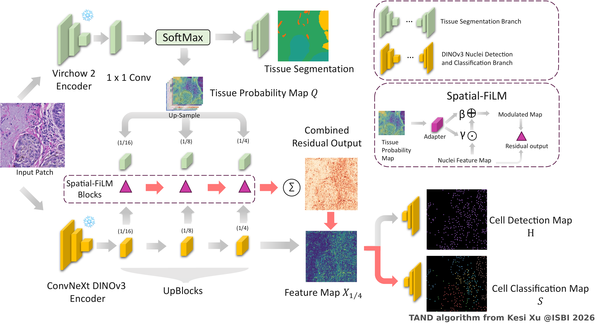

# TAND: Tissue-Aware Nuclei Detection and Classification

<p align="center">
  <b>Joint nuclei detection and classification in histopathology under point-level supervision</b>
</p>

<p align="center">
  <a href="https://arxiv.org/abs/2511.13615"></a>
  <a href="https://biomedicalimaging.org/2026/"></a>
  <a href="#license"></a>
  <a href="https://www.python.org/"></a>
  <a href="https://pytorch.org/"></a>
</p>

<p align="center">
  <a href="#results">Results</a> •
  <a href="#installation">Installation</a> •
  <a href="#usage">Usage</a> •
  <a href="#model-architecture">Architecture</a> •
  <a href="#citation">Citation</a>
</p>

---

This is the official implementation of **TAND** (Tissue-Aware Nuclei Detection), accepted for **Oral Presentation** at [**IEEE ISBI 2026**](https://biomedicalimaging.org/2026/).

> **[Tissue-Aware Nuclei Detection and Classification in Histopathology Images under Point-Level Supervision](https://arxiv.org/abs/2511.13615)**
>
> [Kesi Xu](https://warwick.ac.uk/fac/cross_fac/tia/people/hp-contents/kesixu/)<sup>1</sup>, Eleni Chiou<sup>2</sup>, Ali Varamesh<sup>2</sup>, Laura Acqualagna<sup>2</sup>, [Nasir Rajpoot](https://warwick.ac.uk/fac/sci/dcs/people/nasir_rajpoot/)<sup>1</sup>
>
> <sup>1</sup> University of Warwick &nbsp;&nbsp; <sup>2</sup> GSK

<p align="center">
  &nbsp;&nbsp;&nbsp;&nbsp;
  
</p>

**What is TAND?** — Most cell detection methods either require expensive dense mask annotations, or ignore the tissue microenvironment when classifying nuclei. TAND introduces **Spatial-FiLM conditioning** to selectively inject tissue context into the classification pathway while keeping the detection pathway unmodulated. This enables accurate nuclei typing using only **point-level annotations** (~7x cheaper than masks), outperforming the mask-supervised HoVerNeXt baseline.

**Key contributions:**
- **Spatial-FiLM** — a lightweight, bounded, zero-initialized affine modulation that conditions cell classification on tissue probability maps at multiple decoder scales
- **Selective modulation** — detection head remains tissue-agnostic, preserving heatmap quality
- **Two-phase curriculum** — staged training ensures stable convergence of frozen foundation models with trainable adapters

<p align="center">
  
</p>

## Results

**PUMA Melanoma Benchmark (5-fold CV, 10-class nuclei classification):**

| Method | Supervision | Det F1 | Macro-F1 |
|--------|------------|--------|----------|
| HoVerNeXt | Dense masks | 0.724 ± 0.026 | 0.374 ± 0.022 |
| **TAND** | Points | **0.908 ± 0.010** | 0.344 ± 0.027 |
| **TAND + Aug + Oversample** | Points | 0.864 ± 0.008 | **0.398** |

## Installation

```bash
git clone https://github.com/kesixu/Tissue-Aware-Nuclei-Detection.git
cd TAND

conda create -n tand python=3.10 -y
conda activate tand

pip install torch torchvision --index-url https://download.pytorch.org/whl/cu121
pip install -e .
```

**Requirements:** Python >= 3.9, PyTorch >= 2.1 with CUDA, GPU >= 12 GB VRAM.

The tissue branch uses [Virchow2](https://huggingface.co/paige-ai/Virchow2) (requires HuggingFace license approval):

```bash
huggingface-cli login
```

## Usage

### Model API

```python
import torch
from tand.models.fused_pointcls_unet import VirchowFusedNet

# Build model
model = VirchowFusedNet(num_classes=10, num_tissue=6, film_limit=0.5, pretrained=True)
model.eval()

# Load trained weights
checkpoint = torch.load("path/to/best.pt", map_location="cpu")
model.load_state_dict(checkpoint["model"])
model = model.cuda()

# Forward pass
image = torch.randn(1, 3, 1024, 1024).cuda()  # RGB, [0, 1] normalized
with torch.no_grad():
    outputs = model(image, use_film=True, use_bias=False)

heatmap_logits = outputs["heatmap_logits"]   # [1, 1, 1024, 1024]
class_logits   = outputs["class_logits"]     # [1, 10, 1024, 1024]
tissue_logits  = outputs["tissue_logits_224"] # [1, 6, 224, 224]
```

### Inference on a Dataset

```bash
python scripts/inference.py \
    --data_root path/to/dataset \
    --weights_root path/to/checkpoints \
    --output_dir outputs/predictions \
    --det_thresh 0.35 --nms_radius 3
```

Output: per-image JSON files with detected nuclei `{x, y, cls_id, score}`.

### Training

```bash
python scripts/train.py \
    --model virchow_fused \
    --trainer virchow_fused \
    --fusion-model efficient \
    --data-root path/to/data \
    --mode film_only \
    --train-amp off \
    --epochs 200 --batch-size 2 \
    --augment --oversample-rare 3.0 \
    --only-fold 1
```

> **Note:** `--train-amp off` is mandatory — mixed-precision training causes numerical instability in the detection head.

See [`configs/tand_default.yaml`](configs/tand_default.yaml) for the full hyperparameter reference and [`configs/slurm_example.sh`](configs/slurm_example.sh) for a SLURM job template.

### Data Format

Images: RGB `.png` files. Annotations: JSON with point-level cell centers:

```json
{
  "centers": [
    {"x": 120, "y": 85, "cls": 3},
    {"x": 200, "y": 150, "cls": 9}
  ]
}
```

A `meta.json` file specifying class names is expected at the dataset root.

## Model Architecture

TAND consists of two branches fused via Spatial-FiLM:

1. **Tissue Segmentation Branch** — A frozen [Virchow2](https://huggingface.co/paige-ai/Virchow2) encoder (pretrained on 3.1M histopathology WSIs) with a linear segmentation head, producing tissue probability maps.

2. **Detection-Classification Branch** — An EfficientUNet (or DINOv3-ConvNeXt) encoder-decoder with dual heads: an **unmodulated detection head** for heatmap regression, and a **FiLM-modulated classification head** for cell typing.

### Spatial-FiLM

The core conditioning mechanism. A lightweight convolutional adapter produces spatially-varying affine parameters from tissue probability maps:

```
[gamma, beta] = Adapter(Q; theta)
gamma_hat = tanh(gamma) * eta,    beta_hat = tanh(beta) * eta/2        (eta = 0.5)
x_cls = x * (1 + gamma_hat) + beta_hat
```

Applied at three decoder scales (1/16, 1/8, 1/4) with zero-initialized projections, ensuring the model starts from the pretrained baseline.

### Two-Phase Training

1. **Phase 1** — Pretrain LinearSegHead on tissue segmentation (Virchow2 frozen, Dice + CE loss)
2. **Phase 2** — Train detection backbone + FiLM adapters (SegHead frozen, Focal + Pointwise Focal loss, FiLM warmup for first 20 epochs)

## Project Structure

```
TAND/
├── tand/
│   ├── models/
│   │   ├── backbone.py              # DINOv3-ConvNeXt UNet
│   │   ├── tand_net.py              # DINOv3VirchowFused
│   │   ├── fused_pointcls_unet.py   # EfficientUNet + Virchow2 (default)
│   │   ├── efficientunet.py         # EfficientNet-B0 backbone
│   │   └── virchow2/                # Virchow2 tissue branch
│   ├── modules/
│   │   ├── film.py                  # Spatial-FiLM
│   │   └── caam.py                  # CAAM (ablation variant)
│   ├── data/dataset.py              # Datasets, augmentation, oversampling
│   ├── losses/                      # Focal, Dice, pointwise CE
│   ├── trainers/trainer.py          # Two-phase training logic
│   ├── evaluation/                  # Point matching, NMS, F1 metrics
│   └── utils/viz.py                 # Visualization
├── scripts/
│   ├── train.py                     # Training
│   ├── inference.py                 # Inference with logit export
│   ├── evaluate.py                  # Evaluation
│   └── ensemble.py                  # Multi-model ensemble
├── configs/
│   ├── tand_default.yaml            # Hyperparameter reference
│   └── slurm_example.sh             # SLURM template
├── tests/
├── pyproject.toml
└── LICENSE                          # CC BY-NC 4.0
```

## Citation

If you find this work useful, please cite our paper:

```bibtex
@article{xu2025tissue,
  title   = {Tissue Aware Nuclei Detection and Classification Model for Histopathology Images},
  author  = {Xu, Kesi and Chiou, Eleni and Varamesh, Ali and Acqualagna, Laura and Rajpoot, Nasir},
  journal = {arXiv preprint arXiv:2511.13615},
  year    = {2025}
}
```

## Acknowledgements

<p align="center">
  &nbsp;&nbsp;&nbsp;&nbsp;
  
</p>

- [Tissue Image Analytics (TIA) Centre](https://warwick.ac.uk/fac/cross_fac/tia/), University of Warwick
- [GSK.ai](https://www.gsk.com/) — funding and collaboration
- [Virchow2](https://huggingface.co/paige-ai/Virchow2) (Paige AI) — pathology foundation model
- [PUMA Challenge](https://puma.grand-challenge.org/) — benchmark dataset
- [timm](https://github.com/huggingface/pytorch-image-models) — pretrained model zoo

## License

This project is licensed under the [Creative Commons Attribution-NonCommercial 4.0 International License (CC BY-NC 4.0)](https://creativecommons.org/licenses/by-nc/4.0/).

**You are free to use this code for academic and research purposes. Commercial use is not permitted.**
